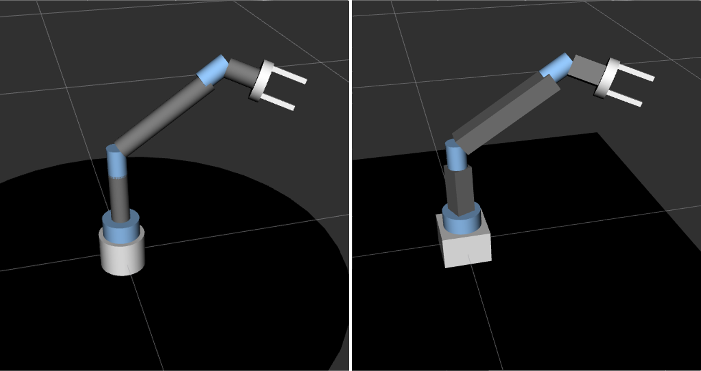
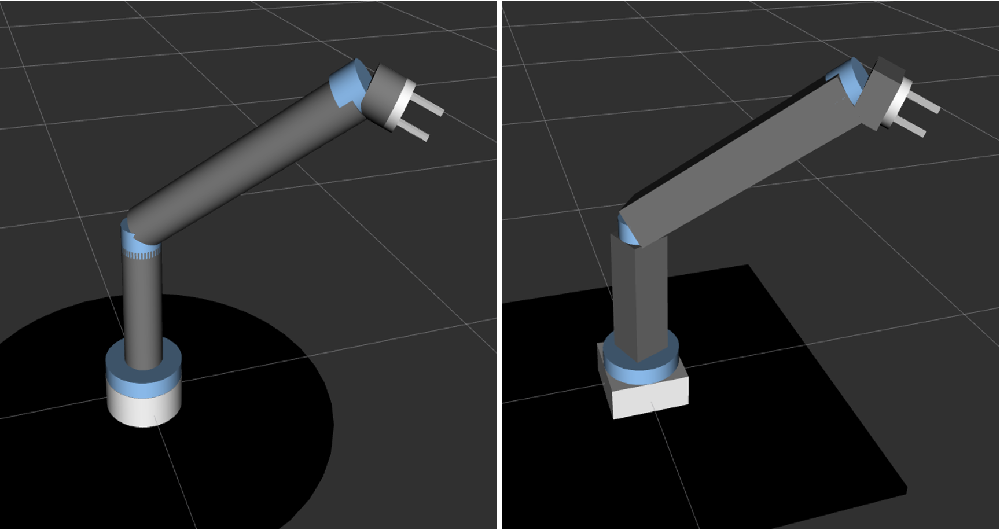
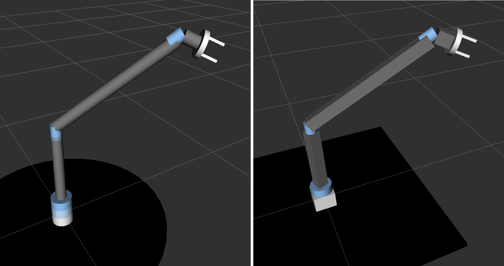
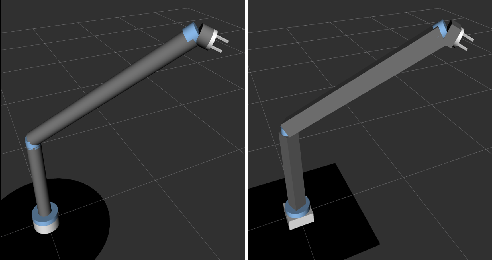

# Custom URDF/Xacro model for 7DOF robot arm
This project aims at building a customizable URDF model for building a 7 degree-of-freedom robot arm. The model consists of eleven links and ten joints. Nine of the joints actuated, seven revolute joints for the arm, and two prismatic joints for the gripper. 

The model aims at providing flexibility to obtain different designs of a 7 DOF arm. With the help of multiple xacro macros. conditional, properties, and mathematical expressions the changes in the main parameters (mentioned blow) are adabted by all the model parts to produce consistent designs of the robot arms.

**The main parameters of the system are:**
 1. The link type, referred to as `LINK_TYPE` in the xacro file.
 2. The shoulder link length, refered to as `SHOULDER_LENGTH` in the xacro file.
 3. The elbow link length, referred to as `ELBOW_LENGTH` in the xacro file.
 4. The link width/radius refered to as `LINK_WIDTH` in the xacro file.
 

With changing only the above-mentioned four parameters, different robot models can be generated.

Noitce that the first parameter `LINK_TYPE` is set once to be `CYLINDER` and another to be `BOX` with the other three parameters the same for each of the following cases

* In the first design, the parameters as well as the generated robot are as follows:
```
    <!--set links type -->
  <xacro:property name="LINK_TYPE" value="CYLINDER"/>
    <!--set shoulder link length-->
  <xacro:property name="SHOULDER_LENGTH" value="0.15"/>
    <!--set elbow link length-->
  <xacro:property name="ELBOW_LENGTH" value="0.22"/>
   <!--set links width(LINK_TYPE = BOX) or radius (LINK_TYPE = CYLINDER)-->
  <xacro:property name="LINK_WIDTH" value="0.05"/> 
```



___

* In the second design, the shoulder length is twice the value in the first design, and the the elbow is three times the previous value.
```
    <!--set links type -->
  <xacro:property name="LINK_TYPE" value="CYLINDER"/>
    <!--set shoulder link length-->
  <xacro:property name="SHOULDER_LENGTH" value="0.30"/>
    <!--set elbow link length-->
  <xacro:property name="ELBOW_LENGTH" value="0.60"/>
   <!--set links width(LINK_TYPE = BOX) or radius (LINK_TYPE = CYLINDER)-->
  <xacro:property name="LINK_WIDTH" value="0.05"/> 
```



___

* In the third design, all the parameters are like the second design, except for the link width/radius which is doubled.

```
    <!--set links type -->
  <xacro:property name="LINK_TYPE" value="CYLINDER"/>
    <!--set shoulder link length-->
  <xacro:property name="SHOULDER_LENGTH" value="0.30"/>
    <!--set elbow link length-->
  <xacro:property name="ELBOW_LENGTH" value="0.60"/>
   <!--set links width(LINK_TYPE = BOX) or radius (LINK_TYPE = CYLINDER)-->
  <xacro:property name="LINK_WIDTH" value="0.10"/> 
```



___


* In the fourth design, the shoulder length as well as the elbow length are twice the values in the third design and the link width/radius is the same.

```
    <!--set links type -->
  <xacro:property name="LINK_TYPE" value="CYLINDER"/>
    <!--set shoulder link length-->
  <xacro:property name="SHOULDER_LENGTH" value="0.60"/>
    <!--set elbow link length-->
  <xacro:property name="ELBOW_LENGTH" value="1.22"/>
   <!--set links width(LINK_TYPE = BOX) or radius (LINK_TYPE = CYLINDER)-->
  <xacro:property name="LINK_WIDTH" value="0.10"/> 
```



___

### Visualize the arm in Rviz and simulate in Gazebo world
This [project](https://github.com/Robotawi/rrr-arm) shows the second step in the development, which is to visalize the arm in Rviz, and simulate in Gazebo. The third step of the development is to produced MoveIt package for our robots, and interface them with Gazebo. This [project](https://github.com/Robotawi/rrr_arm_config) details how to do the third step with your custom robot arm. 

