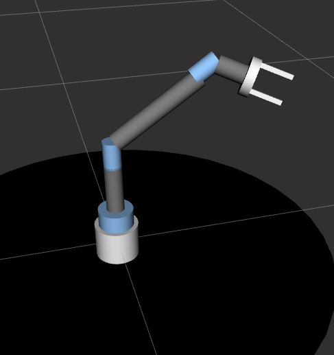
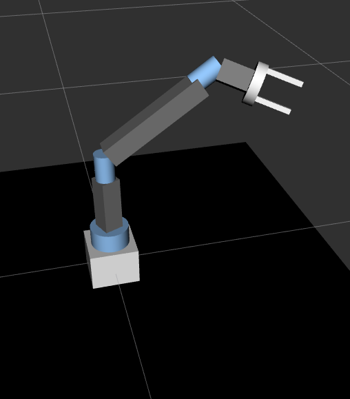

# complex-robot-arm_ros
This project has three aims that are very important to robotic manipulation engineers
1. Build the URDF model of a 6 DOF robotic arm.
2. Visualize the arm in Rviz for the iterative design and the testing. 
3. Simulate the arm in Gazebo after adding the required gazebo tags/components like collision, inertial, and transmission tags. 

#### 1. Build the URDF model of a 6 DOF robotic arm.
My Xacro model build a 6 dof robotic arm using multiple xacro proprties for flexible change of the model. The model has two link types `BOX`, and `CYLINDER`. It has parametrized link lengths for the shoulder pitch link and the elbow pitch link. To control the link types, set it as either of the following.

```
<xacro:property name="LINK_TYPE" value="CYLINDER"/>
```

```
<xacro:property name="LINK_TYPE" value="BOX"/>
```


To change the shoilder or the elbow link length, set the desired valuein the following 
```
<xacro:property name="shoulder_pitch_len" value="2.14"/> <!--set shoulder link length-->

<xacro:property name="elbow_pitch_len" value="2.22"/> <!--set elbow link length-->
```

#### 2. Visualize the arm in Rviz for the iterative design and the testing. 

To run this model in rviz, the following file needs to be saved in the package's urdf directory and the following launch file in the launch directory
```
<?xml version="1.0"?>
<launch>
  <param name="robot_description" command="$(find xacro)/xacro --inorder $(find six_dof_arm)/urdf/six_dof_arm.xacro" />

  <node name="joint_state_publisher" pkg="joint_state_publisher_gui" type="joint_state_publisher_gui"/>
  <node name="robot_state_publisher" pkg="robot_state_publisher" type="robot_state_publisher"/> 

  <node name="rviz" pkg="rviz" type="rviz" args="-d $(find mastering_ros_robot_desc_pkg)/urdf.rviz" required="true"/>

</launch>

```

#### 3. Simulate the arm in Gazebo after adding the required gazebo tags/components.